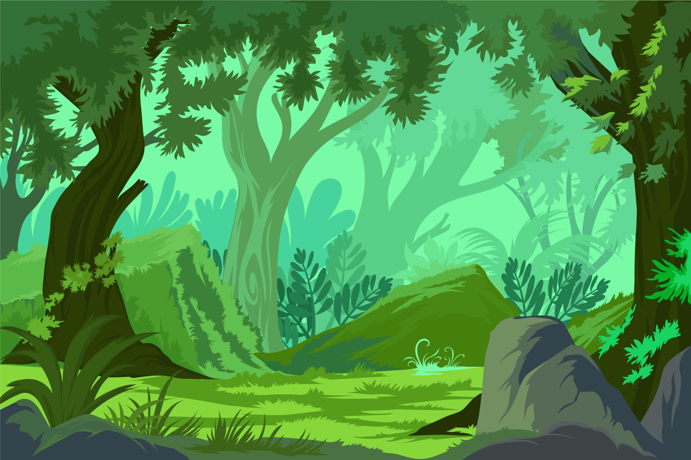
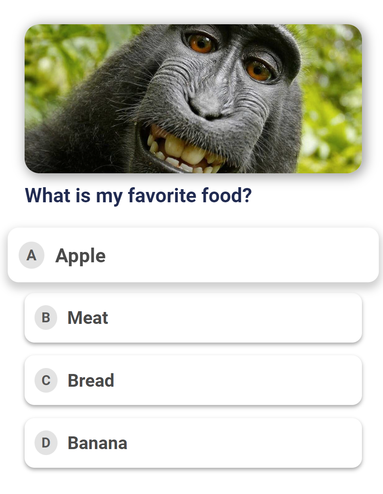

# Animal Quiz

# Repository
https://github.com/AdamFiejtek/animals-quiz

# Live Website
https://adamfiejtek.github.io/animals-quiz/

Portfolio Project 2

# Author
Adam Fiejtek

# Project Overview

Play this quiz to learn more about Animal Kingdom and English in a funny and easy way!

## Table of Contents
- [Animal Quiz](#animal-quiz)
- [Repository](#repository)
- [Live Website](#live-website)
- [Author](#author)
- [Project Overview](#project-overview)
  * [Table of Contents](#table-of-contents)
- [UX](#ux)
  * [Target Audience](#target-audience)
  * [Project Goals](#project-goals)
  * [User Stories](#user-stories)
    + [Customer Side:](#Customer-side-)
    + [Developer Side:](#Developer-side-)
  * [Design Choices](#design-choices)
    + [Colors](#Colors)
    + [Fonts](#Fonts)
    + [Animations and Transitions](#animations-and-transitions)
  * [Design Elements](#design-elements)
  * [Wireframes](#wireframes)
    + [Features](#features)
  * [Implemented Features](#implemented-features)
  * [Future Features](#future-features)
- [Testing](#testing)
  * [Validation Testing](#validation-testing)
    + [CSS Validation](#css-validation)
    + [HTML Validation](#html-validation)
    + [Javascript Validation](#javascript-validation)
  * [Compatibility and Responsive Testing](#compatibility-and-responsive-testing)
  * [Manual Testing](#manual-testing)
  * [Accessibility](#accessibility)
    + [Keyboard Navigation](#keyboard-navigation)
- [Technologies Used](#technologies-used)
  * [Languages](#languages)
  * [Frameworks, Libraries & Programs Used](#frameworks--libraries---programs-used)
- [Deployment](#deployment)
  * [Deploy to GitHub Pages](#deploy-to-github-pages)
  * [Credits](#credits)
  * [Content](#content)
  * [Media](#media)
  * [Acknowledgments](#acknowledgments)

<small><i><a href='http://ecotrust-canada.github.io/markdown-toc/'>Table of contents generated with markdown-toc</a></i></small>

# UX
## Target Audience
Animal Quiz is a simple, but visually pleasant quiz for old and young alike!

## Project Goals
- Main goal is to develop a simple quiz playable for all ages, which can be used to teach animal names in English
- Appealing look as main target are young players

## Usability
### Customer Side:
- Simple site navigation
- Clear rules 
- Visually attractive content

### Developer Side:
- Naming conventions make reading code easy 
- Code reusability for future expansion / improvements
- Simplicity in design and execution

## Design Choices
### Colors

Contrasting theme idea - wooden table in a warm and sunny room.

### Fonts

Font style and size were selected to ensure the best readability for the user.

### Animations and Transitions
Buttons are getting bigger and highlighted when hovered, getting smaller when pressed down:

## Design Elements

The fully responsive design of each card (HTML and CSS built, no images to improve responsiveness):

### Features
## Implemented Features
- Easy to navigate, simple one-page design with semantic construction - header, main section, and footer:

    
    
-  Score counter:

    
    
- Correct / Wrong answers shown, once choice is made, for learning purposes:

    
    
- Dynamic game interface with hiding buttons:

    
 

- Animated buttons:

    

## Future Features
The plan for the next updates is to add virtual currency and implement a betting system for each deal.

# Testing
The site was tested in 4 browsers for Windows PC - Chrome, Firefox, Edge, and Opera. No issues were detected. Chrome browser test passed - no issues detected. Mobile browsers tested - Chrome, Firefox, Samsung browser - no issues detected. The site is fully responsive for every size device.
My friends helped me a lot with game testing so I can assure you that the current version is free of bugs, responsive, and it's a lot of fun to play.

## Validation Testing
### CSS Validation
No errors were found in the style.css file:

### HTML Validation
No errors in the index.html file:

### Javascript Validation
No errors in JS files (script.js and constants.js combined):

## Compatibility and Responsive Testing
As the biggest market share in Ireland belongs to Chrome and Safari, I focused on these two browsers and didn't forget about others too.

iPhone 8:

Ipad Pro 12.9:

Mac:

## Manual Testing
https://docs.google.com/spreadsheets/d/17U5ND_qIVSv95PoQ_jnpY4RGTwZ9w-D3pBOQB5yGjtA/edit?usp=sharing

### Defect Tracking
- Fix bug - new game button text overflow with button borders - detected and fixed on 28.11.2022
-

### Defects of Note
The most frustrating bug to find and remove was the situation when the computer was losing the game and didn't take another card (when he clearly could take one more to win).
Also implementing the variable value of Ace (1 or 11) was a nightmare at the beginning and caused a lot of defects.

## Outstanding Defects
This is possible to break the game score if the user goes to local storage files and changes the values stored for something not expected. Need to implement function preventing manipulation with local storage file.

## Accessibility
Mobile version:

Desktop version:

The accessibility score for mobile devices is 97 points due to the warning for color contrast, however, I've tested the game on multiple devices and the color contrast is ok in my opinion (my testers (and friends :)) agree with me). For the desktop, it's 100. Aria labels and titles are used in this project.

### Keyboard Navigation
The game is keyboard friendly - all navigation tests passed. I've used the focus function to bring focus to key buttons and implemented a function to close modals with any button on the keyboard down.

# Technologies Used
## Languages
- HTML
- CSS
- Java Script

## Frameworks, Libraries & Programs Used
List out the tools used:
- Font Awesome
- GitPod
- GitHub
- Google fonts

# Deployment

## Deploy to GitHub Pages

The site was deployed to GitHub pages:

1. Go to the GitHub EngineBoostGarage repository then open settings:

  
    
2. Select pages:
  
  
    
3. Choose a source to deploy from a branch, then select the main branch and save:

  
  

## Credits
- https://learn.codeinstitute.net/ - Love Maths project and other lessons
- https://stackoverflow.com/ - code inspirations
- https://www.w3schools.com/ - code inspirations

## Content
- https://www.cs.mcgill.ca/~rwest/wikispeedia/wpcd/wp/b/Blackjack.htm - how to play section

## Media
- https://www.pexels.com - Ace of spades logo img and favicon
- https://fontawesome.com/ - icons
- https://fontjoy.com/ - font pairing
- https://coolors.co/ - colors combination

## Acknowledgments

Big thanks to Malia Havlicek - Code Institute mentor for her ideas and support in this project!
Also, I would like to thank all my friends for live testing the game!

- https://validator.w3.org/ - HTML validator
- https://jigsaw.w3.org/ - CSS validator
- https://jshint.com/ - JS validator
- https://web.dev - performance testing
